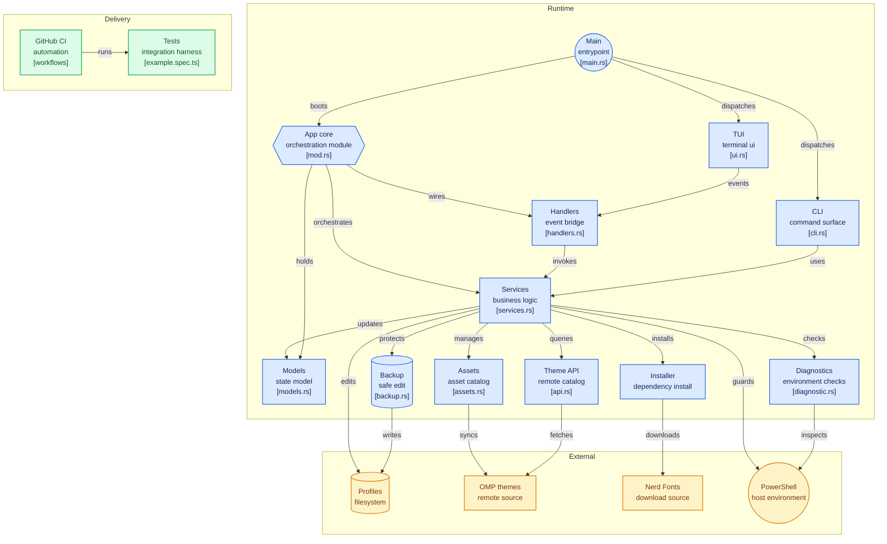

# PoshBuddy

   [](https://github.com/julesklord/poshbuddy/actions/workflows/rust.yml) [](https://github.com/julesklord/poshbuddy/actions/workflows/security.yml)

PoshBuddy manages Oh My Posh configurations. It provides a terminal user interface (TUI) and a command-line interface (CLI) to configure themes and install Nerd Fonts on Windows, Linux, and macOS. It supports PowerShell, Bash, Zsh, and Fish shells.

<p align="center">
  
</p>

Developed in Rust, PoshBuddy handles shell environment stabilization and configuration file auditing.

## Features

### Theme Management

PoshBuddy manages local and remote Oh My Posh themes. The ThemeAsset engine interfaces with local files and GitHub repositories to discover and install themes.

### Segment Manipulation

The tool performs targeted edits on active themes. It toggles segments such as Git status, battery indicators, and execution time without modifying other theme components.

### Profile Injection

PoshBuddy configures shell profiles using a marker-based injection system. This keeps modifications reversible and isolated within the scripts.

## Capabilities

- **Stability**: Implements network timeouts and Oh My Posh binary checks to prevent interface freezes.
- **Multi-Shell Profile Sync**: Detects and updates PowerShell, Bash, Zsh, and Fish profiles.
- **Previews**: Generates isolated theme previews independent of active shell states.
- **Diagnostics**: Checks for Nerd Fonts, shell versions, and terminal compatibility.

## Technical Architecture

PoshBuddy uses modern systems programming patterns:

- **Rust**: Core logic and memory safety.
- **Tokio**: Asynchronous runtime for network operations and file I/O.
- **Ratatui**: TUI rendering loop.
- **Serde**: Serialization for JSON configuration processing.

## Installation

Install via [crates.io](https://crates.io/crates/poshbuddy):

```sh
cargo install poshbuddy
```

### Build from Source

Requires the [Rust toolchain](https://rustup.rs/).

```sh
git clone https://github.com/julesklord/poshbuddy.git
cd poshbuddy
cargo install --path .
```

*Note: Requires the Oh My Posh binary in the system PATH.*

## CLI Mode

PoshBuddy includes a command-line interface for headless operations.

### Theme Commands

- **Set Theme**: `poshbuddy set theme <name>`
  - Searches local and official remote catalogues.
- **List Themes**: `poshbuddy list themes [--local] [--remote]`
  - Displays available themes in a table.

### Font Commands

- **Install Font**: `poshbuddy install font <name>`
  - Installs Nerd Fonts to the system.
- **List Fonts**: `poshbuddy list fonts`
  - Lists official Nerd Fonts.

### Examples

```powershell
poshbuddy set theme bubbles
poshbuddy list themes --local
poshbuddy install font FiraCode
```

## Navigation

| Key         | Action                                                         |
| :---------- | :------------------------------------------------------------- |
| **1**       | **Themes Explorer** — Browse local and remote themes.          |
| **2**       | **Font Manager** — Manage Nerd Fonts.                          |
| **3**       | **Segment Manager** — Toggle theme components.                 |
| **Esc / H** | **Dashboard** — Return to the main screen.                     |
| **Enter**   | Apply theme, toggle segment, or start installation.            |
| **Q**       | Exit.                                                          |

### Dashboard Actions

| Key   | Action                                |
| :---- | :------------------------------------ |
| **R** | Apply a **Random Theme**.             |
| **N** | Install **All Nerd Fonts**.           |
| **I** | Toggle **Terminal Icons**.            |
| **D** | Run **Diagnostics**.                  |
| **V** | View and restore **Backups**.         |
| **B** | Create **Manual Backup**.             |

## Architecture Diagram



## Resources

- [Wiki](docs/wiki/index.md) - Architecture overview.
- [GitHub repository](https://github.com/julesklord/poshbuddy) - Source code.
- [Changelog](CHANGELOG.md) - Version history.
