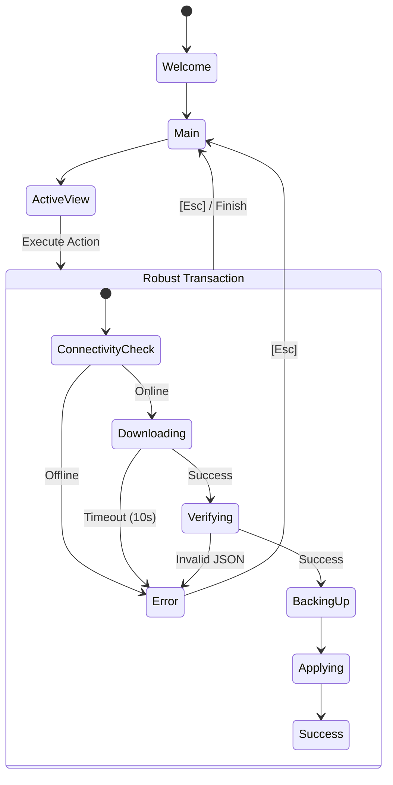

# PoshBuddy Wiki: Dashboard

> **Updated**: 2026-04-13  
> **Version**: v0.3.3-rust  
> **Read Time**: 5 min  

PoshBuddy is a cross-platform TUI (Terminal User Interface) written in Rust, specifically designed to eliminate the friction of managing **Oh My Posh** themes and Nerd Fonts on Windows and PowerShell environments.

## Problem Statement

Customizing a PowerShell prompt typically involves manual JSON editing, multiple shell profile syncs (`$PROFILE`), and external font installations. PoshBuddy automates this entire lifecycle from a single, unified interface.

| Feature | PoshBuddy TUI | Manual JSON | PowerShell Scripts |
| :--- | :--- | :--- | :--- |
| **Preview** | Real-time ANSI Render | None | Static/Broken |
| **Profile Sync** | Automatic (5.1 & 7) | Manual | Hardcoded |
| **Font Manager** | Integrated | External | None |
| **Robustness** | 10s Timeouts/Connectivity | Eternal Hang | Unpredictable |

## The Robustness Engine (v0.3.3)

PoshBuddy implements a "Staff Engineer" grade robustness layer. This system ensures the TUI never hangs, regardless of network conditions or external binary stalls.

### 4-Stage Transactional Pipeline
Every change (Theme or Font) follows an atomic 4-stage process:
1. **Connectivity Check**: Pre-flight validation of internet access.
2. **Download & Verify**: Secure fetching with 10s timeouts and JSON integrity checks.
3. **Surgical Backup**: Instant snapshot of your PowerShell profile before modification.
4. **Atomic Application**: Marker-based injection ensures profile integrity.

### State Machine Architecture


## 5-Minute Quickstart

### 1. Build from Source

Ensure you have [Rust](https://rustup.rs/) installed.

```powershell
PS> git clone https://github.com/julesklord/poshbuddy.git
PS> cd poshbuddy
PS> cargo run --release
```

### 2. Startup Diagnostics

On first launch, PoshBuddy will run a system check for:
- **Nerd Fonts** (Required for icons)
- **PowerShell 7** (Recommended for performance)
- **Terminal Emulator** (Windows Terminal recommended)

### 3. Choose & Apply

Use the arrows `[UP/DOWN]` to find a theme and press `[ENTER]` to apply it instantly to all your PowerShell profiles.

---
**Next Step**: [Installation & Prerequisites](./installation.md)
