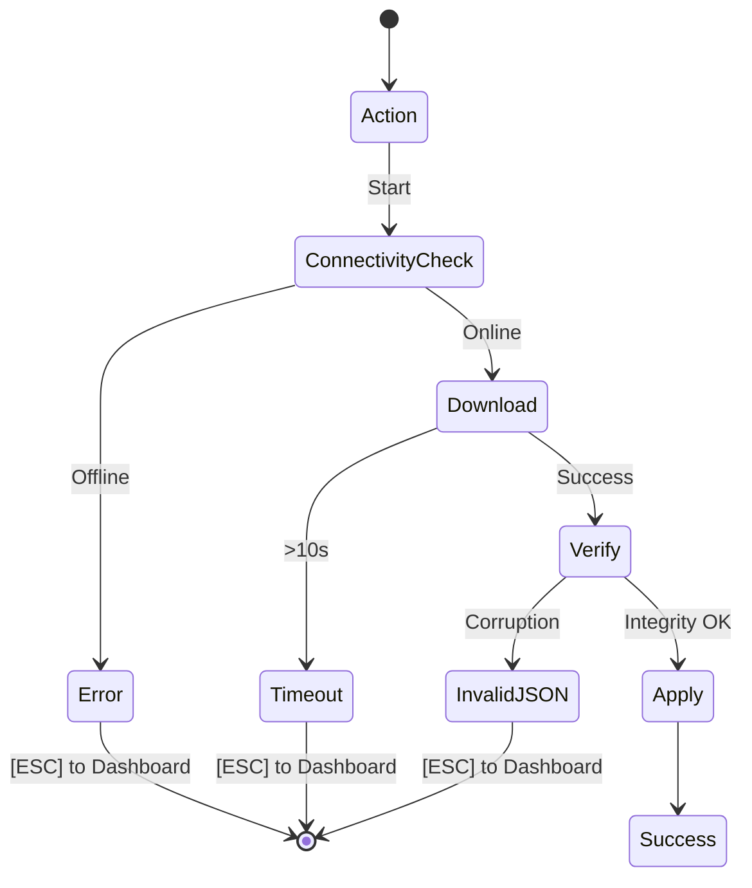

# PoshBuddy Wiki: Troubleshooting Procedures

> **Updated**: 2026-04-13  
> **Version**: v0.3.3-rust  
> **Read Time**: 5 min  

PoshBuddy categorizes issues into deterministic symptoms. If your issue persists after following these directives, consult the system logs.

## Error Lifecycle Diagram

## Symptom: Broken icons (Squares/Question marks)

**Cause**: System lacks a properly configured Nerd Font.

- **Fix 1**: Install a font directly from the **Fonts [2]** tab.
- **Fix 2**: In Windows Terminal settings (PowerShell > Appearance), set **Font face** to any font suffix ending in "Nerd Font" or "NF".
- **Fix 3**: In VS Code settings, set `"terminal.integrated.fontFamily": "'MesloLGS NF'"` or your specific font name.

## Symptom: Themes not applying after "Success" notification

**Cause**: Current shell session requires environment refresh.

- **Fix 1**: Close and restart the terminal session.
- **Fix 2**: Execute `. $PROFILE` to force-reload configuration in the active window.
- **Fix 3**: Validate profile paths. PoshBuddy detects standard paths for PS 5.1 and 7. Check the **Diagnostic** screen to ensure your profile path is listed under "Detected Profiles".

## Symptom: Terminal latency / Slow startup

**Cause**: Excessive module imports in the PowerShell profile.

- **Fix**: Open your `$PROFILE` and remove redundant `Import-Module` calls. PoshBuddy ensures the initialization line is optimized: `oh-my-posh init pwsh ...`.

## Symptom: "Error: No internet connection detected"

**Cause**: System failed the PoshBuddy pre-flight connectivity check.

- **Fix**: Restore network access. PoshBuddy prevents remote operations during offline states to guarantee UI responsiveness.

## Symptom: "Timeout generating preview"

**Cause**: External `oh-my-posh` binary exceeded the 2-second render guard.

- **Fix 1**: Verify the selected theme file integrity.
- **Fix 2**: Reduce system CPU load; the security guard triggers if the render cannot complete within the 2s safety window.

---
**Return to**: [Wiki Dashboard](./index.md)
